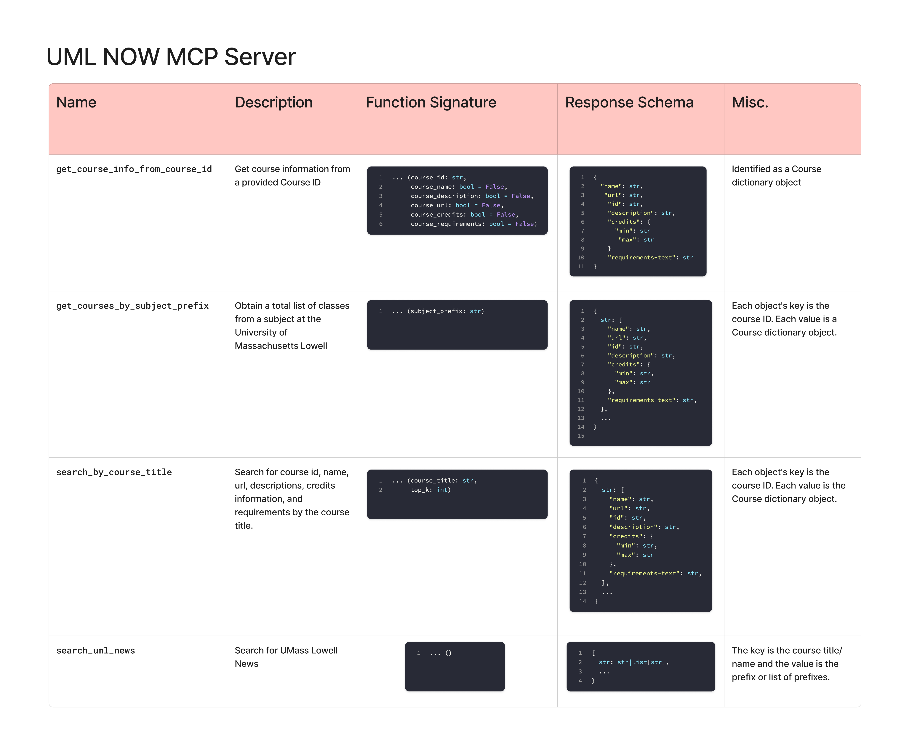

# UML Now MCP Server

An MCP Server for interacting with the UML Now API

**By using this, you agree to the terms and conditions set forth in the [University of Massachusetts Lowell API Terms of Service](https://www.uml.edu/api/Static/tos.html).**

# Usage
The MCP server can be used locally by either
- Run as a host process: `uv run server.py`
  - Accessible at `localhost:8000/mcp`
- Run as a docker container: `./build_and_run.sh`
  - Accessible at `0.0.0.0:8000/mcp` or `localhost:8000/mcp` locally

> [!NOTE]
> If you're using the MCP Inspector tool for local development, uml-now-mcp uses the Streamable HTTP transport, not STDIO or server-sent events (SSE). 

For production deployments on kubernetes check the reference manifest, `k8s/kubernetes_prod.yaml`.

## Technologies
- Docker
- MCP

# 🛠️ Tool Calls

